# Sprawozdanie z laboratorium 5

## Temat

Wyznaczanie rozkladu SVD macierzy oraz analiza zbieznosci metody potegowej
dla roznych norm wektorowych.

## Cel cwiczenia

Celem cwiczenia bylo:

- wylosowanie macierzy kwadratowej $A$,
- wyznaczenie rozkladu SVD na podstawie macierzy $AA^T$,
- porownanie recznie wyznaczonego rozkladu z wynikiem funkcji bibliotecznej
  `np.linalg.svd`,
- sprawdzenie zachowania metody potegowej dla norm $p = 1, 2, 3, 4$
  oraz $p = \infty$,
- analiza bledow w kolejnych iteracjach algorytmu.

## Dane wejsciowe

W notebooku ustawiono ziarno generatora losowego:

```python
rng = np.random.default_rng(20260611)
```

Otrzymano macierz:

$$
A =
\begin{bmatrix}
3 & -9 & -3 \\
7 & -7 & -5 \\
4 & -3 & 4
\end{bmatrix}
$$

Nastepnie obliczono macierz:

$$
AA^T =
\begin{bmatrix}
99 & 99 & 27 \\
99 & 123 & 29 \\
27 & 29 & 41
\end{bmatrix}
$$

## Opis metody

Do wyznaczenia rozkladu SVD wykorzystano fakt, ze kolumny macierzy $U$
sa wektorami wlasnymi macierzy $AA^T$, a wartosci osobliwe sa pierwiastkami
z wartosci wlasnych tej macierzy:

$$
\sigma_i = \sqrt{\lambda_i}.
$$

Po wyznaczeniu macierzy $U$ oraz diagonalnej macierzy $D$ obliczono macierz
$V$ ze wzoru:

$$
V = A^T U D^{-1}.
$$

W implementacji zastosowano transpozycje tak wyznaczonej macierzy, aby
rekonstrukcja miala postac:

$$
A = UDV.
$$

Metoda potegowa zostala zastosowana do macierzy $B = AA^T$. Dla zadanego
wektora startowego $z$ wykonywano iteracje:

$$
w = Bz,
$$

$$
\lambda = \max_i(w_i),
$$

$$
e = \|Bz - \lambda z\|_p,
$$

a nastepnie normalizowano nowy wektor:

$$
z_{new} = \frac{w}{\|w\|_p}.
$$

Warunkiem stopu bylo:

$$
e < \varepsilon,
$$

gdzie w eksperymencie przyjeto:

$$
\varepsilon = 10^{-4}.
$$

## Wyniki rozkladu SVD

Wartosci wlasne macierzy $AA^T$:

$$
\lambda =
\begin{bmatrix}
219.514331 & 32.253704 & 11.231965
\end{bmatrix}
$$

Wartosci osobliwe:

$$
\sigma =
\begin{bmatrix}
14.816016 & 5.679234 & 3.351412
\end{bmatrix}
$$

Macierz $U$:

$$
U =
\begin{bmatrix}
0.648210 & -0.109623 & 0.753529 \\
0.729996 & -0.192066 & -0.655908 \\
0.216630 & 0.975240 & -0.044475
\end{bmatrix}
$$

Macierz $D$:

$$
D =
\begin{bmatrix}
14.816016 & 0 & 0 \\
0 & 5.679234 & 0 \\
0 & 0 & 3.351412
\end{bmatrix}
$$

Macierz $V$:

$$
V =
\begin{bmatrix}
0.534633 & -0.782515 & -0.319120 \\
0.392241 & -0.104706 & 0.913884 \\
-0.748542 & -0.613764 & 0.250955
\end{bmatrix}
$$

Rekonstrukcja $UDV$ daje:

$$
UDV =
\begin{bmatrix}
3 & -9 & -3 \\
7 & -7 & -5 \\
4 & -3 & 4
\end{bmatrix}
$$

czyli odtworzono macierz wejsciowa $A$.

## Porownanie z `np.linalg.svd`

W notebooku porownano wynik recznej rekonstrukcji z wynikiem otrzymanym
za pomoca funkcji `np.linalg.svd`. Bledy policzono jako norme roznicy
macierzy potraktowanej jak wektor.

| Norma | Blad $\|UDV - SVD(A)\|_p$ |
|---:|---:|
| $p = 1$ | $2.042810365310 \cdot 10^{-14}$ |
| $p = 2$ | $9.294098618032 \cdot 10^{-15}$ |
| $p = 3$ | $7.827529282246 \cdot 10^{-15}$ |
| $p = 4$ | $7.408228362716 \cdot 10^{-15}$ |
| $p = \infty$ | $7.105427357602 \cdot 10^{-15}$ |

Bledy sa rzedu $10^{-14}$, co oznacza zgodnosc wynikow z dokladnoscia
do bledow zaokraglen arytmetyki zmiennoprzecinkowej.

## Zbieznosc metody potegowej

Dla kazdej normy wykonano metode potegowa z deflacja dla trzech kolejnych
wektorow. Ponizsza tabela przedstawia liczbe iteracji, pierwszy blad,
ostatni blad oraz informacje, czy spelniono warunek $e < 10^{-4}$.

| Norma | Wektor | Liczba iteracji | Pierwszy blad | Ostatni blad | Warunek stopu |
|---:|---:|---:|---:|---:|:---:|
| $p = 1$ | 1 | 1000 | $1.1629 \cdot 10^2$ | $1.1904 \cdot 10^2$ | nie |
| $p = 1$ | 2 | 1000 | $6.2407 \cdot 10^1$ | $6.4551 \cdot 10^1$ | nie |
| $p = 1$ | 3 | 1000 | $3.3187 \cdot 10^1$ | $3.5004 \cdot 10^1$ | nie |
| $p = 2$ | 1 | 1000 | $1.0097 \cdot 10^2$ | $5.9270 \cdot 10^1$ | nie |
| $p = 2$ | 2 | 1000 | $1.7892 \cdot 10^1$ | $1.6003 \cdot 10^1$ | nie |
| $p = 2$ | 3 | 1000 | $2.6979 \cdot 10^0$ | $7.9860 \cdot 10^{-1}$ | nie |
| $p = 3$ | 1 | 1000 | $1.0321 \cdot 10^2$ | $3.6525 \cdot 10^1$ | nie |
| $p = 3$ | 2 | 1000 | $7.1518 \cdot 10^0$ | $6.0773 \cdot 10^0$ | nie |
| $p = 3$ | 3 | 1000 | $2.4457 \cdot 10^0$ | $9.6811 \cdot 10^{-2}$ | nie |
| $p = 4$ | 1 | 1000 | $1.0363 \cdot 10^2$ | $2.5224 \cdot 10^1$ | nie |
| $p = 4$ | 2 | 1000 | $4.3924 \cdot 10^0$ | $1.3404 \cdot 10^{-2}$ | nie |
| $p = 4$ | 3 | 1000 | $6.3325 \cdot 10^0$ | $2.8983 \cdot 10^0$ | nie |
| $p = \infty$ | 1 | 8 | $1.0373 \cdot 10^2$ | $2.3508 \cdot 10^{-5}$ | tak |
| $p = \infty$ | 2 | 11 | $1.1707 \cdot 10^1$ | $7.4625 \cdot 10^{-5}$ | tak |
| $p = \infty$ | 3 | 1000 | $5.0118 \cdot 10^0$ | $1.4551 \cdot 10^0$ | nie |

## Wykresy bledow

### Norma $p = 1$

| Wektor 1 | Wektor 2 | Wektor 3 |
|---|---|---|
| 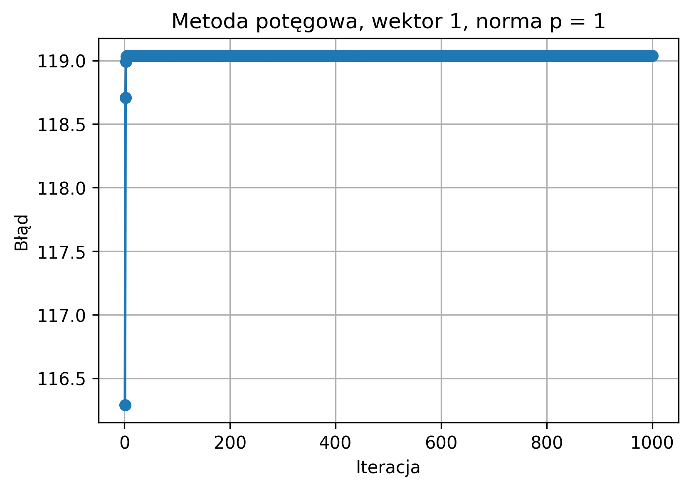 |  |  |

### Norma $p = 2$

| Wektor 1 | Wektor 2 | Wektor 3 |
|---|---|---|
|  | 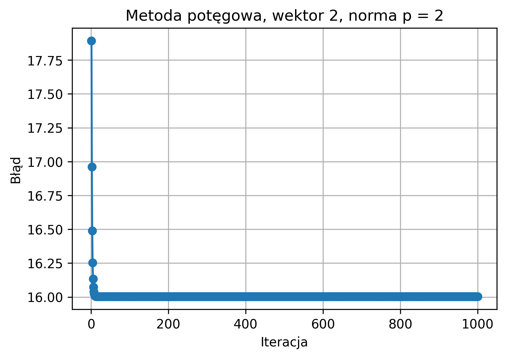 | 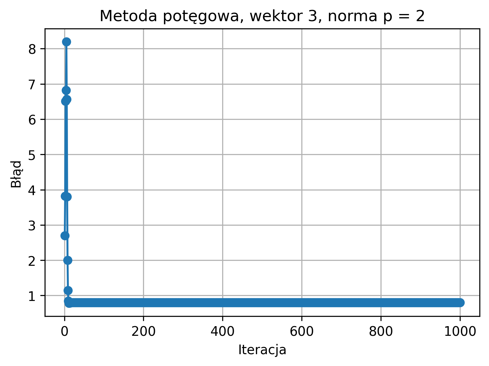 |

### Norma $p = 3$

| Wektor 1 | Wektor 2 | Wektor 3 |
|---|---|---|
| 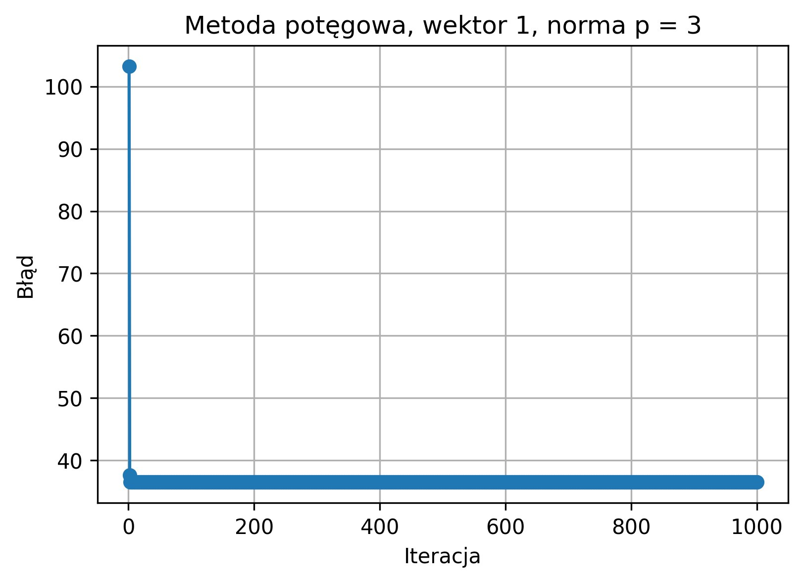 | 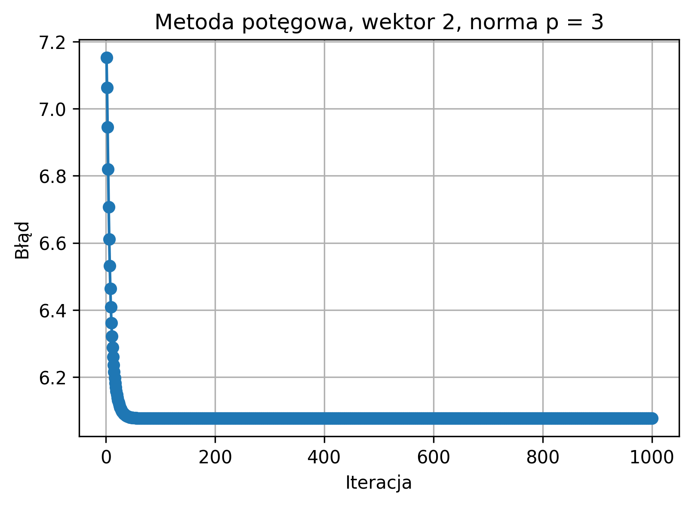 | 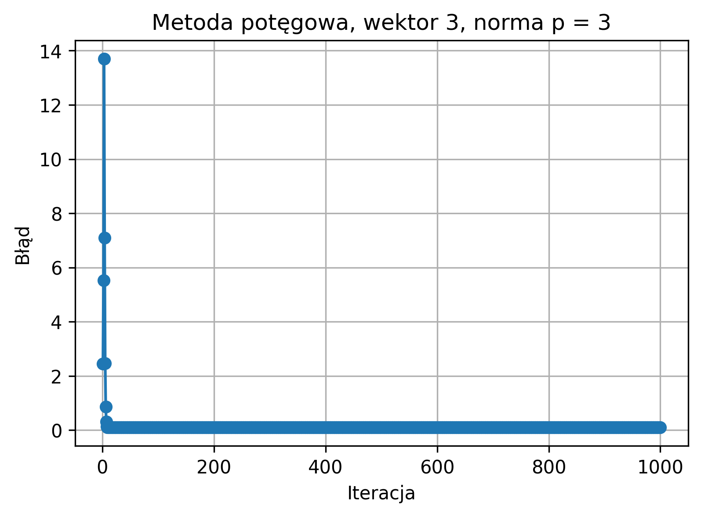 |

### Norma $p = 4$

| Wektor 1 | Wektor 2 | Wektor 3 |
|---|---|---|
|  | 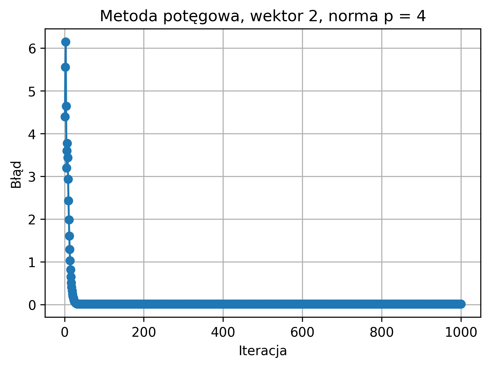 | 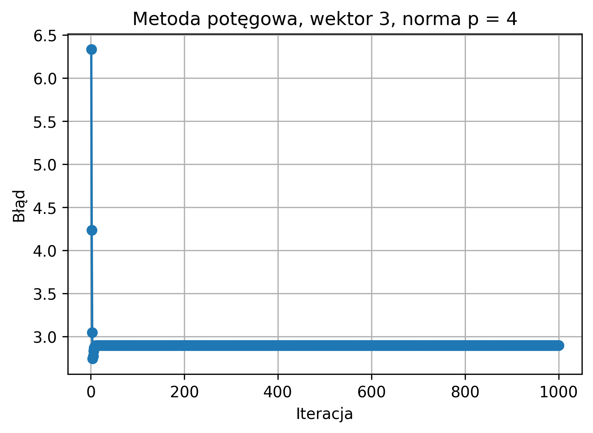 |

### Norma $p = \infty$

| Wektor 1 | Wektor 2 | Wektor 3 |
|---|---|---|
| 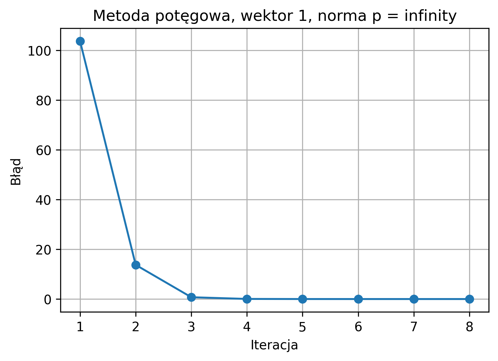 | 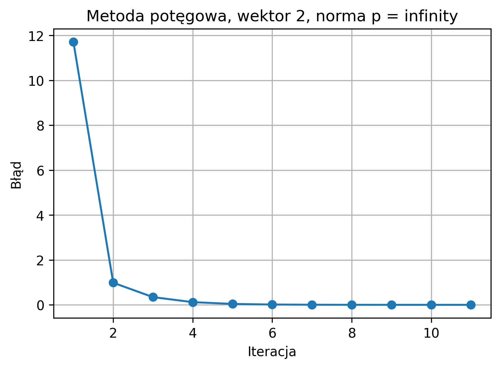 | 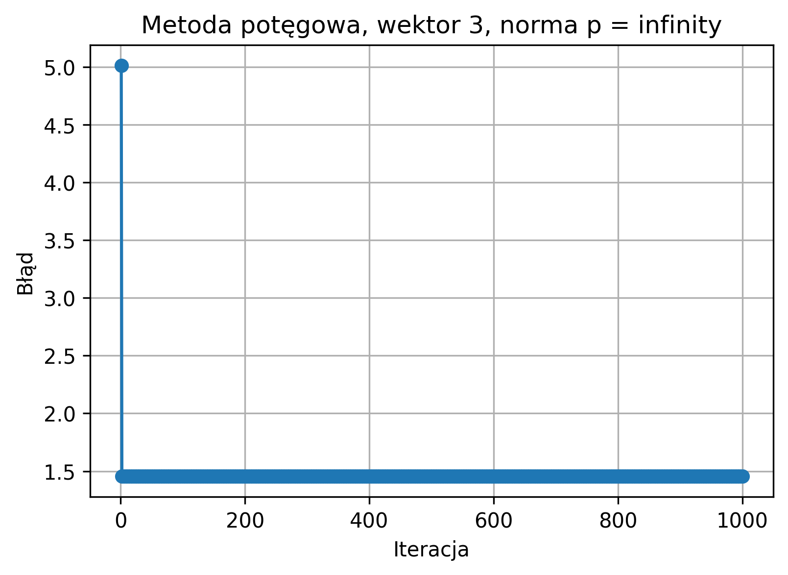 |

## Analiza wynikow

Recznie wyznaczony rozklad SVD poprawnie rekonstruuje macierz $A$.
Porownanie z funkcja `np.linalg.svd` daje bardzo male bledy, dlatego
wyniki mozna uznac za poprawne numerycznie.

W przypadku metody potegowej widac wyrazna roznice pomiedzy norma
nieskonczonosc a pozostalymi normami. Dla norm $p = 1, 2, 3, 4$ blad
nie spadl ponizej zadanej tolerancji $10^{-4}$ i algorytm konczyl prace
po osiagnieciu maksymalnej liczby 1000 iteracji.

Najlepsza zbieznosc wystapila dla normy $p = \infty$. Dla pierwszego
wektora warunek stopu zostal spelniony po 8 iteracjach, a dla drugiego
po 11 iteracjach. Trzeci wektor dla tej normy nie osiagnal jednak zadanej
dokladnosci.

Takie zachowanie wynika z przyjetego sposobu estymacji wartosci wlasnej:

$$
\lambda = \max_i(w_i).
$$

Ten estymator jest najbardziej zgodny z normalizacja w normie
nieskonczonosc, poniewaz w tej normie decydujace znaczenie ma najwieksza
wspolrzedna wektora. Dla pozostalych norm ta sama estymacja wartosci
wlasnej moze nie prowadzic do zaniku bledu
$\|Bz - \lambda z\|_p$, nawet gdy kierunek wektora w iteracjach zaczyna
sie stabilizowac.

## Wnioski

1. Rozklad SVD wyznaczony na podstawie macierzy $AA^T$ jest zgodny
   z wynikiem funkcji `np.linalg.svd`.
2. Bledy rekonstrukcji sa rzedu $10^{-14}$, co odpowiada bledom
   zaokraglen numerycznych.
3. Metoda potegowa z estymacja $\lambda = \max_i(w_i)$ dziala najlepiej
   dla normy $p = \infty$.
4. Dla norm $p = 1, 2, 3, 4$ algorytm nie osiagnal zadanej dokladnosci
   w limicie 1000 iteracji.
5. Wyniki pokazuja, ze sposob wyznaczania przyblizonej wartosci wlasnej
   powinien byc dobrany do zastosowanej normalizacji i normy bledu.
